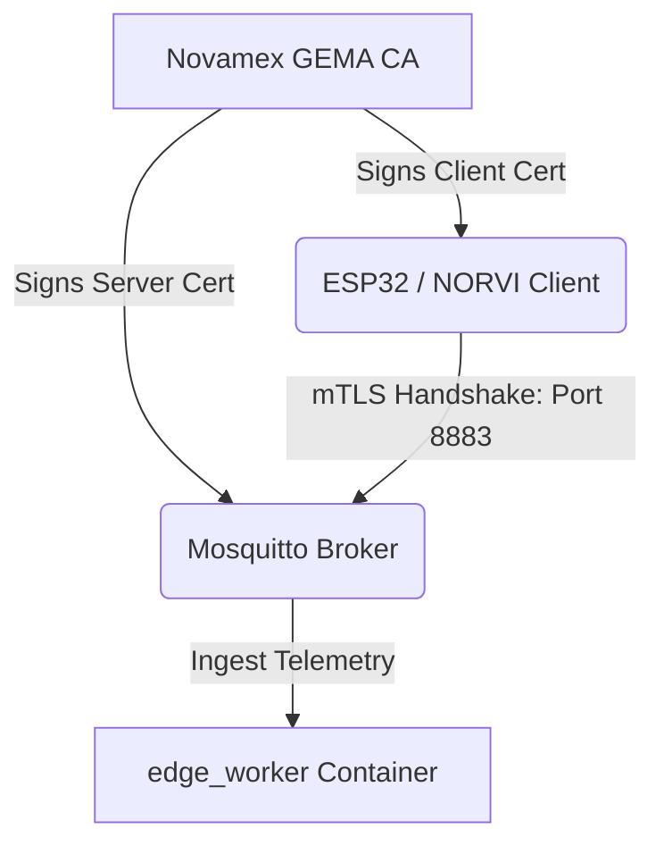

# EdgeOps Security Hardening & Zero-Trust Architecture (mTLS)

This document outlines the security architecture implemented in the GEMA V3.0 perimetral gateway, focusing on **Zero-Trust Network Access (mTLS)** and **Hardware-level Edge Hardening** for ESP32/NORVI field nodes.

---

## 1. Zero-Trust Network Architecture (mTLS Broker)

In industrial IoT deployments, trusting the local perimetral network is a critical vulnerability. Our gateway enforces a **Zero-Trust Mutual TLS (mTLS)** policy at the transport boundary to ensure cryptographic verification of all external devices before any data is ingested.

### PKI Architecture Diagram


### Network Port Isolation Policy
1.  **Secure Port `8883` (MQTTS)**: Exposed to the external local network (OT network). Exiges absolute client certificate verification (`require_certificate true`). Any node without a private key signed by the private Root CA is immediately rejected at the TLS handshake level.
2.  **Private Port `1883` (MQTT)**: Bound strictly inside the isolated bridge network `edge-net`. Available only to cluster microservices (`edge_worker`, `cloud_sync`, `simulator`, `system_monitor`). External packages cannot bypass TLS by hitting this port since it is closed to outside interfaces.

---

## 2. Certificates Hierarchy and Generation

Certificates are managed locally via `/scripts/generate_mtls_certs.sh`.

-   **Root CA (`ca.crt` / `ca.key`)**: 4096-bit RSA trust root. Stored securely on the gateway and used to sign keys.
-   **Broker Server (`server.crt` / `server.key`)**: 2048-bit RSA key signed by the CA, with SAN extensions configured for `mosquitto` container and host loopbacks to prevent Hostname Verification failures.
-   **Client Device (`client.crt` / `client.key`)**: 2048-bit RSA key signed by the CA, flashed to field hardware transmitters.

---

## 3. Hardware Hardening: ESP32 & NORVI Protection

Ensuring mTLS at the broker is useless if an attacker can unscrew the telemetry node from the DIN rail, plug in a USB cable, and read out the private keys (`client.key`) from raw flash memory. 

To mitigate physical attack vectors, the firmware team **MUST** enable **Flash Encryption (AES-256)** and **Secure Boot V2 (RSA-3072)** on all ESP32-S3/NORVI hardware modules.

### A. Flash Encryption (AES-256)
Enabling Flash Encryption prevents the readout of firmware binaries, certs, and partition contents. The flash is encrypted using an internal key burnt permanently into the chip's eFuses.

#### Enable Flash Encryption via ESP-IDF:
1.  Set the config flags in `sdkconfig`:
    ```ini
    CONFIG_SECURE_FLASH_ENCRYPTION_MODE_RELEASE=y
    CONFIG_SECURE_FLASH_UART_BOOTLOADER_ALLOW_ENC=n
    CONFIG_SECURE_FLASH_UART_BOOTLOADER_ALLOW_DEC=n
    CONFIG_SECURE_FLASH_REQUIRE_AES_KEY_SIZE_256=y
    ```
2.  Build the project. The bootloader and partition tables will be built to support hardware encryption.
3.  Upon the first boot cycle, the ESP32 internally generates the random AES key, encrypts the flash partitions on-the-fly, and permanently burns the eFuse control lines to prevent decryption or read-back.

---

### B. Secure Boot V2 (RSA-3072)
Secure Boot V2 prevents the execution of unsigned or malicious firmware binaries on the device by verifying the cryptographic signature of the bootloader and the application binary before startup.

#### Provisioning Secure Boot V2:
1.  Generate a secure signing key on the development workstation:
    ```bash
    espsecure.py generate_signing_key --version 2 secure_boot_signing_key.pem
    ```
2.  Configure `sdkconfig` to enable Secure Boot V2:
    ```ini
    CONFIG_SECURE_BOOT=y
    CONFIG_SECURE_BOOT_V2_ENABLED=y
    CONFIG_SECURE_BOOT_BUILD_SIGNED_BINARIES=y
    CONFIG_SECURE_BOOT_SIGNING_KEY="secure_boot_signing_key.pem"
    ```
3.  Burn the public key digest permanently into the ESP32's eFuse Block (during production flashing):
    ```bash
    espefuse.py -p /dev/ttyUSB0 burn_key secure_boot_v2 secure_boot_signing_key.pem
    ```
4.  Flash the signed application. During every boot sequence, the ROM bootloader will verify the signature on the app partitions using the key digest stored in the eFuse block.

---

### C. eFuse Controller Hardening (JTAG & Bootloader Disable)
To fully close physical interfaces, the following control registers **MUST** be permanently blown using `espefuse.py`:

```bash
# 1. Disable physical debugging interface (JTAG)
espefuse.py -p /dev/ttyUSB0 burn_efuse DIS_PAD_JTAG

# 2. Disable direct UART download commands (prevents raw memory reading/flashing)
espefuse.py -p /dev/ttyUSB0 burn_efuse DIS_DOWNLOAD_MODE
```

> [!WARNING]
> Blowing eFuse bits is a **permanent, destructive physical operation**. Once eFuses are blown (such as `DIS_DOWNLOAD_MODE`), the chip cannot be reprogrammed via standard USB download interfaces; firmware updates must be dispatched via encrypted OTA (Over-The-Air) channels only. Make sure bootloader testing is complete before blowing these registers in production.
