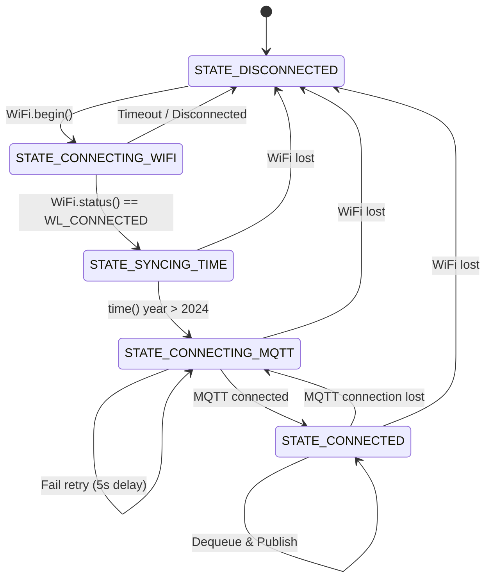

# Proposal: Norvi Network and NTP Integration

This proposal outlines the integration of secure, resilient network communications for the Norvi monitor node on the ESP32. The networking stack runs inside `vTaskNetworking` pinned to Core 0 (PRO_CPU), fully isolated from the real-time DSP and digital input tasks on Core 1.

## Quick Path

1. **Configure dependencies**: Add `knolleary/PubSubClient` and `bblanchon/ArduinoJson` to `platformio.ini`.
2. **Wi-Fi Manager (Resilient)**: Implement a non-blocking connection machine that checks `WiFi.status()` and automatically reconnects without using busy-waiting loops.
3. **NTP Blocking Synchronization**: Sync system time via NTP server `pool.ntp.org`. Block MQTT client initialization until local time is verified (year > 2024).
4. **mTLS Setup (Zero Trust)**: Configure `WiFiClientSecure` with CA Cert, Client Cert, and Client Private Key.
5. **MQTT Publisher**: Dequeue events from `productionEventQueue` and serialize into the Payload Universal JSON structure to publish on topic `novamex/ibarra/production/norvi_001` over port 8883.

---

## Connection State Machine Design

To ensure the ESP32 doesn't block the RTOS scheduler or trigger watchdogs, connection logic is implemented as an explicit, non-blocking state machine in `vTaskNetworking`:



### Connection State Descriptions:
1. **`STATE_DISCONNECTED`**: Resets all connection flags and triggers `WiFi.begin(ssid, password)`.
2. **`STATE_CONNECTING_WIFI`**: Non-blocking poll of `WiFi.status()`. If it fails to connect within a timeout window (e.g., 15s), it delays and retries.
3. **`STATE_SYNCING_TIME`**: Calls `configTime()`. Checks the system time every 1s. **Blocks MQTT initialization** until the year > 2024.
4. **`STATE_CONNECTING_MQTT`**: Applies mTLS certificates to `WiFiClientSecure` and calls `mqttClient.connect()` with Last Will and Testament (LWT) configured to publish a `node_health = OFFLINE` message (Sparkplug B Lite standard).
5. **`STATE_CONNECTED`**: Keeps the MQTT link alive via `mqttClient.loop()`. Checks the `productionEventQueue` using `xQueueReceive(..., 10)`. If an event is dequeued, it constructs and publishes the Payload Universal JSON.

---

## Universal JSON Payload Mapping

Every MQTT message must comply with the universal schema:
```json
{
  "node_health": "ONLINE",
  "metrics": [
    {
      "name": "production_cycle",
      "value": event.cycleCount,
      "timestamp": "ISO_8601_FORMATTED_NTP_TIME"
    }
  ]
}
```

---

## Risks, Tradeoffs, and Assumptions

### Risks
* **Blocking NTP Sync**: If the NTP server is unreachable, the system will never connect to MQTT.
  - *Mitigation*: This is intentional behavior to prevent SSL handshake errors due to invalid/1970 client times. System continues monitoring inputs and buffering to the queue (up to 50 events) in the meantime.
* **Large Certificate Sizes**: Certificates consume memory in stack/heap.
  - *Mitigation*: Run `vTaskNetworking` with a stack size of at least `8192` bytes (instead of 4096) to handle the TLS stack comfortably.

### Tradeoffs
* **Async Event Dequeuing vs Publisher Failures**: Events are dequeued only when both WiFi and MQTT are active.
  - *Benefit*: Prevents event loss by leaving events in the FreeRTOS Queue during network outages.

### Assumptions
* Local MQTT Broker IP is statically defined or passed via config.
* Secure port is 8883.
